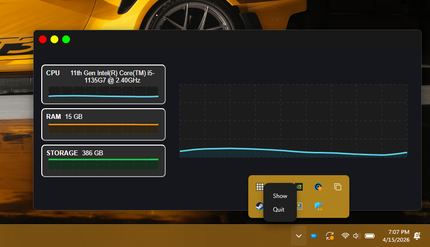

# PerfHawk 🔍

PerfHawk is a cross-platform desktop(Windows and MacOS) performance monitoring tool. It collects and analyzes performance data to help developers identify and fix performance issues in the computer.



## Features
- Provides real-time performance monitoring of the computer while running on background.
- Collects performance data from the Operating System using the Chromium performance APIs.
- Provides a user-friendly interface for analyzing performance data.
- Supports various performance metrics, including CPU usage, memory usage, and storage.
## Technologies Used
- Electron: A framework for building cross-platform desktop applications using web technologies.
- React(Typescript): A JavaScript library for building user interfaces.
- Node.js: A JavaScript runtime for building server-side applications.
- Chromium Performance APIs: Used to collect performance data from the Operating System.
- Playwright: For End-to-End testing of the application.
- Vitest: For unit testing of the application.
## Installation & Setup
To install PerfHawk, follow these steps:
- Clone the repository from GitHub:
```git clone https://github.com/B1N4L/perf-hawk.git```
- Navigate to the project directory:
```cd perf-hawk```
- Install the required dependencies:
```npm install```
- Start the development server:
```npm run dev```
- The Electron application will launch automatically, and you can start using PerfHawk to monitor your browser's performance.
- (Open your browser and navigate to `http://localhost:5123` to access the PerfHawk interface.)
- Note: Make sure you have Node.js and npm installed on your system before running the above commands.
- For production builds for each OS, you can use the following commands:
```npm run dist:win``` (for Windows)
```npm run dist:mac``` (for MacOS)
## Usage
Once you have PerfHawk up and running, you can use it to monitor the performance of your browser:
- Open the PerfHawk interface in your browser and start a performance monitoring session.
- Switch between RAM, CPU, and Storage tabs to view different performance metrics.
## Folder Structure

```text
perf-hawk/
|-- desktopIcon.png
|-- electron-builder.json
|-- eslint.config.js
|-- index.html
|-- package-lock.json
|-- package.json
|-- playwright.config.ts
|-- README.md
|-- src/
|   |-- assets/
|   |   |-- hero.png
|   |   |-- react.svg
|   |   |-- screenshot.png
|   |   |-- trayIcon.png
|   |   |-- trayIconTemplate.png
|   |   `-- vite.svg
|   |-- electron/
|   |   |-- main.js
|   |   |-- main.ts
|   |   |-- menu.ts
|   |   |-- pathResolver.js
|   |   |-- pathResolver.ts
|   |   |-- preload.cjs
|   |   |-- preload.cts
|   |   |-- resourceManager.js
|   |   |-- resourceManager.ts
|   |   |-- tray.ts
|   |   |-- tsconfig.json
|   |   |-- util.js
|   |   `-- util.ts
|   |-- ui/
|   |   |-- App.css
|   |   |-- App.js
|   |   |-- App.tsx
|   |   |-- components/
|   |   |   |-- BaseChart.tsx
|   |   |   |-- Chart.tsx
|   |   |   |-- Header.tsx
|   |   |   `-- SelectOption.tsx
|   |   |-- hooks/
|   |   |   |-- useStaticData.tsx
|   |   |   `-- useStatistics.tsx
|   |   |-- index.css
|   |   |-- main.js
|   |   `-- main.tsx
|   `-- test-unit/
|       `-- tray.test.ts
|-- tests-e2e/
|   `-- example.spec.ts
|-- dist/
|-- dist-electron/
|-- dist-react/
|-- node_modules/
|-- playwright-report/
|-- test-results/
|-- tsconfig.app.json
|-- tsconfig.node.json
|-- tsconfig.json
|-- types.d.ts
`-- vite.config.ts
```

## Key Concepts/Learning Points*
- Implementing IPC communication between the Electron main process and the React renderer process to enable real-time performance monitoring.
- Improved TypeScript type safety across modules
- Utilizing the Chromium performance APIs to collect performance data from the Operating System.
- Implementing a user-friendly interface for analyzing performance data using React.
- Cross-platform development using Electron to ensure compatibility with both Windows and MacOS.
- Using Playwright for End-to-End testing to ensure the reliability and stability of the application.
- Using Vitest for unit testing to ensure the correctness of individual components and functions in the application.

## [Contributing?]
Contributions to PerfHawk are welcome! If you have any ideas for new features or improvements, please feel free to submit a pull request or open an issue on GitHub.
